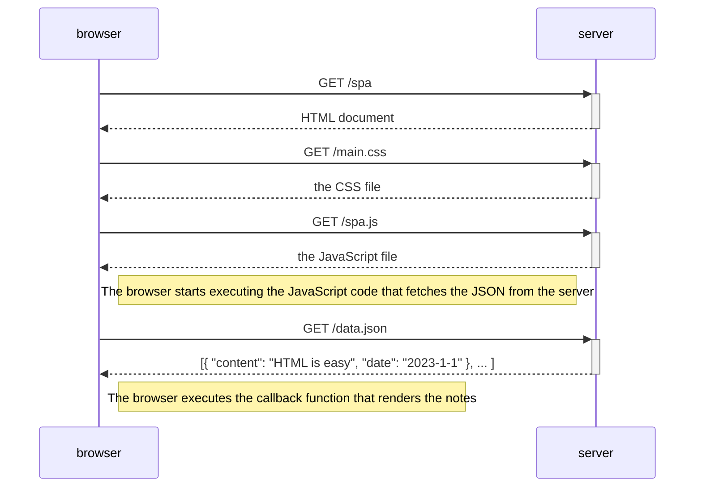

```mermaid
sequenceDiagram
    participant browser
    participant server

    browser->>+server: GET /spa
    server-->>-browser: HTML document
    browser->>+server: GET /main.css
    server-->>-browser: the CSS file
    browser->>+server: GET /spa.js
    server-->>-browser: the JavaScript file
    Note right of browser: The browser starts executing the JavaScript code that fetches the JSON from the server
    browser->>+server: GET /data.json
    server-->>-browser: [{ "content": "HTML is easy", "date": "2023-1-1" }, ... ]
    Note right of browser: The browser executes the callback function that renders the notes
```
